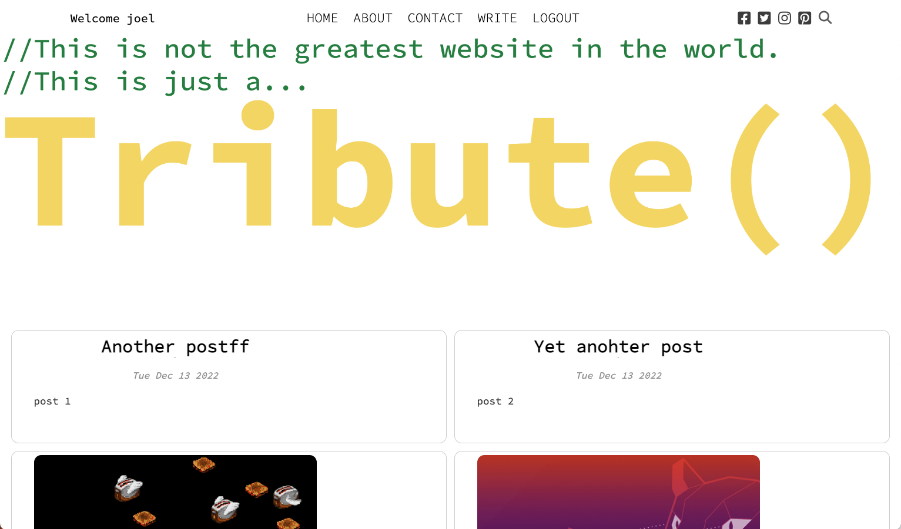

### Final Project - Blog website

# Description
A simple blog site. You can create an account and create posts. 

# Demo

# Technologies
Front End:
    Axios
    react
    react-dom
    react-router-dom
    react-scripts
    react-share
    web-vitals
    nodemon

Back end:
    bcrypt
    dotenv
    express
    mongoose
    multer
    nodemon
    path

# Run the app
1. clone the respository
2. run npm i inside the client and api folders to install all neccessary packages.
3. use start command nodemon on client and api folders to start the front end and back end.
4. go to http://localhost:3000 to visit the homepage.

# Issues
1. fix social media links on topbar.
2. login and register errors crash app.

